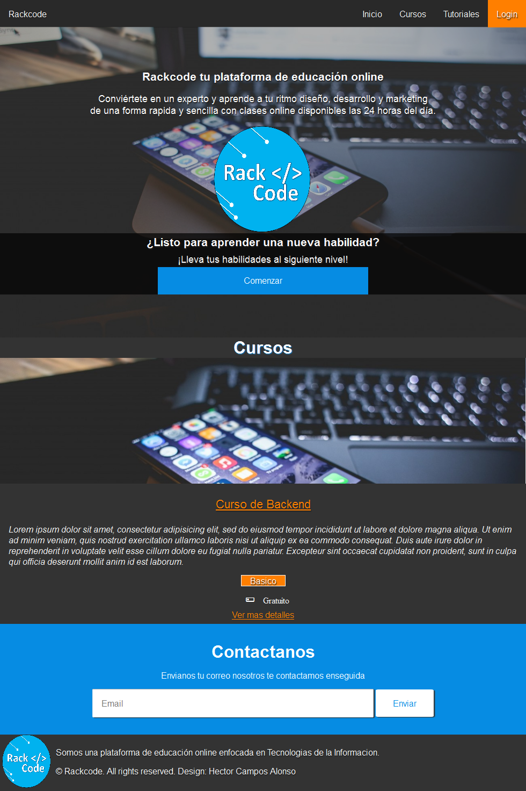

# Rackcode by @Huixcospartan

*Plataforma de Educacion Online - Version 1.0 [Rackcode](//rackcode.info)*

Rackcode tu plataforma de educación online

Conviértete en un experto y aprende a tu ritmo diseño, desarrollo y marketing
de una forma rapida y sencilla con clases online disponibles las 24 horas del día.

Aprende tecnicas de desarollo con practicos tutoriales elaborados por estudiantes de la plataforma con temas de Tecnologia, Programacion, Diseño Web, Desarrollo Movil, Linux y las todas las nuevas tendencias tecnologicas

## Tabla de contenidos
1. [Cursos](#cursos)
2. [Tutoriales](#tutoriales)
3. [Login](#login)

## Cursos
Visualizacion de listado de cursos con una tabla de contenido segmentado de acuerdo a 
Contenido.

**[Volver arriba](#tabla-de-contenidos)**

## Tutoriales

Visualizacion de tutoriales de acuerdo a tags ejemplo Backend, Frontend

**[Volver arriba](#tabla-de-contenidos)**

## Login

Esta funcionalidad aun no esta disponible pero las 

1. [Facebook]
2. [Twitter]

**[Volver arriba](#tabla-de-contenidos)**

## Licencia
#### (The MIT License)

Copyright (c) 2015 Hector Campos Alonso

Permission is hereby granted, free of charge, to any person obtaining
a copy of this software and associated documentation files (the
'Software'), to deal in the Software without restriction, including
without limitation the rights to use, copy, modify, merge, publish,
distribute, sublicense, and/or sell copies of the Software, and to
permit persons to whom the Software is furnished to do so, subject to
the following conditions:

The above copyright notice and this permission notice shall be
included in all copies or substantial portions of the Software.

THE SOFTWARE IS PROVIDED 'AS IS', WITHOUT WARRANTY OF ANY KIND,
EXPRESS OR IMPLIED, INCLUDING BUT NOT LIMITED TO THE WARRANTIES OF
MERCHANTABILITY, FITNESS FOR A PARTICULAR PURPOSE AND NONINFRINGEMENT.
IN NO EVENT SHALL THE AUTHORS OR COPYRIGHT HOLDERS BE LIABLE FOR ANY
CLAIM, DAMAGES OR OTHER LIABILITY, WHETHER IN AN ACTION OF CONTRACT,
TORT OR OTHERWISE, ARISING FROM, OUT OF OR IN CONNECTION WITH THE
SOFTWARE OR THE USE OR OTHER DEALINGS IN THE SOFTWARE.
